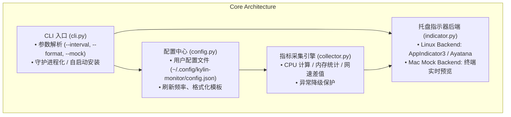

# 信创银河麒麟极轻量任务栏性能监视器 (Kylin Taskbar Monitor)
## 项目设计与完整开发计划规范

> **目标**：在 macOS 上完成全部代码编写、模块解耦与本地 Mock 测试，通过标准 `pyproject.toml` 打包为通用 Python Wheel (`.whl`)，无缝发布到 Git 或私有 PyPI，在兆芯/海光等国产信创系统（银河麒麟 V10 SP1 / 统信 UOS）上通过 `pip` / `uv` 一键安装，实现零卡顿、极低开销的任务栏状态常驻。

---

## 一、 项目背景与架构理念

### 1. 核心痛点与性能约束
- **目标环境**：国产信创系统（如兆芯 KX-U6780A，单核弱、核显 C-960 无硬解加速，银河麒麟 V10 SP1）。
- **必须恪守的架构原则**：
  1. **零 GUI 进程开销**：不使用 PyQt/PySide 或 Electron，仅利用 Linux 桌面标准规范 **StatusNotifierItem / AppIndicator**，把文字渲染完全托管给宿主任务栏面板（UKUI Panel）。
  2. **零子进程调用**：严禁执行 `top`、`free`、`netstat` 等外部 shell 命令，全部通过 `/proc` 接口（C-Extension `psutil`）进行纯内存微积分计算。
  3. **内存控制在 10MB 左右，CPU 占用 < 0.05%**。
  4. **Mac 开发自测友好**：内置 macOS/模拟运行模式（Terminal Mock），在 Mac 上无需 Linux GTK 环境即可自测核心采集算法与格式化逻辑。

---

## 二、 系统架构设计



---

## 三、 模块详细设计

### 1. `config.py` (配置层)
- **配置路径**：`~/.config/kylin-monitor/config.json`
- **可配项**：
  ```json
  {
    "interval": 2.0,
    "format": "CPU {cpu}% | 内存 {mem_used_g:.1f}G | ↓{down_speed} | ↑{up_speed}",
    "net_interface": "auto",
    "icon": "utilities-system-monitor"
  }
  ```
- **特性**：如果配置文件不存在，自动生成带注释默认配置；支持命令行参数覆盖配置文件。

### 2. `collector.py` (采集层)
- **输入**：配置项、时间戳增量 `dt`
- **计算逻辑**：
  - `cpu_percent()`: 实时 CPU 总占比；
  - `mem_info()`: 内存总大小、已用、占比，自动换算 GB/MB；
  - `net_speed()`: 记录上一次 `bytes_recv` 与 `bytes_sent`，除以采样间隔 `dt`，智能单位自适应（`KB/s` 或 `MB/s`）。
- **优化**：保留上一次状态单例，避免反复重置网卡计数器。

### 3. `indicator.py` (展示抽象层)
- **抽象基类 `BaseIndicator`**：定义 `start()`, `update_label(str)`, `stop()`
- **Linux 原生后端 `LinuxAppIndicator`**：
  - 动态导入 `gi.repository.AppIndicator3`，若失败则降级导入 `AyatanaAppIndicator3`；
  - 绑定 GLib 事件循环，在 GLib 主线程中通过 `timeout_add_seconds` 触发采集并更新状态栏文本；
  - 创建右键上下文菜单（「打开设置」、「关于」、「退出」）。
- **macOS / 开发预览后端 `MockIndicator`**：
  - 在 Mac 本地终端模拟输出状态，无需安装 GTK 依赖即可验证刷新频率与计算精度。

### 4. `installer.py` (开机自启辅助)
- 提供 `kylin-monitor --install` 与 `--uninstall`：
  - 自动向 `~/.config/autostart/kylin-taskbar-monitor.desktop` 写入自启动配置，实现“开箱即用”。

---

## 四、 跨平台开发与打包规范

### 1. `pyproject.toml` 标准结构
采用现代 Python 官方打包标准（PEP 517/518/621）：
```toml
[build-system]
requires = ["hatchling"]
build-backend = "hatchling.build"

[project]
name = "kylin-taskbar-monitor"
version = "0.1.0"
description = "Ultra-lightweight taskbar system performance monitor for Kylin OS and Linux."
readme = "README.md"
requires-python = ">=3.8"
license = "MIT"
authors = [
    { name = "Huang Wei" }
]
dependencies = [
    "psutil>=5.8.0",
]

[project.scripts]
kylin-monitor = "kylin_taskbar_monitor.cli:main"
```

---

## 五、 4 阶段详细开发计划

### 阶段 1：本地脚手架与采集核心 (Day 1)
- [ ] 编写 `config.py`，实现配置读写、参数解析与单位格式化函数（`format_bytes`）；
- [ ] 编写 `collector.py`，实现 `MetricsCollector`，在 Mac 上编写单元测试验证 CPU、内存、网速差值计算的准确性；
- [ ] 跑通 `pytest tests/test_collector.py`。

### 阶段 2：Indicator 抽象与 Mock 预览 (Day 1~2)
- [ ] 编写 `indicator.py`，完成 `BaseIndicator` 抽象；
- [ ] 编写 `MockIndicator`（终端原地刷新模式 `sys.stdout.write('\r...')`），实现在 Mac 终端运行 `python -m kylin_taskbar_monitor.cli --mock` 即可看到实时滚动的监控条；
- [ ] 完善 `LinuxAppIndicator` 真实 Linux 托盘逻辑与右键菜单。

### 阶段 3：CLI 与系统级自启集成 (Day 2)
- [ ] 编写 `installer.py`，实现一键生成/删除 `~/.config/autostart/*.desktop` 文件；
- [ ] 整合 `cli.py`：支持参数 `--interval`, `--mock`, `--install`, `--uninstall`, `--config`。

### 阶段 4：打包构建与信创部署验证 (Day 3)
- [ ] 在 Mac 上执行构建：
  ```bash
  python3 -m pip install build
  python3 -m build --wheel
  ```
  生成 `dist/kylin_taskbar_monitor-0.1.0-py3-none-any.whl`。
- [ ] 传到信创本或通过私有 Git 仓库进行安装：
  ```bash
  # 信创本上仅需：
  pip install kylin_taskbar_monitor-0.1.0-py3-none-any.whl
  kylin-monitor --install  # 一键注册开机自启
  kylin-monitor &          # 立即在右下角常驻生效！
  ```

---

## 六、 开发者自检清单
1. **纯 Python Wheel 检查**：打出来的 `.whl` 必须是 `py3-none-any.whl`（不包含任何平台绑定的 C 动态库，因为 `psutil` 会在信创机本地根据系统自动拉取对应平台 wheel）。
2. **容错机制**：如果信创机缺少 `gir1.2-appindicator3`，程序应当友好打印提示：`sudo apt install gir1.2-appindicator3-0.1`，而不是直接 Traceback 崩溃。
3. **休眠无唤醒**：确保在 GLib 定时器之外没有任何多余的线程或自旋锁占用 CPU。
